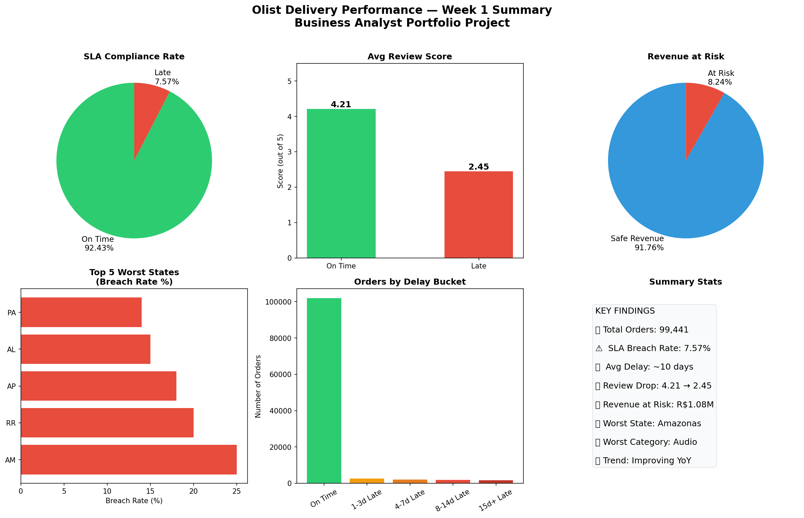

#  Supply Chain & Last Mile Analytics
## Brazilian E-Commerce Olist Dataset | Business Analyst Portfolio Project

---

## Problem Statement
A global e-commerce company is experiencing delivery failures 
impacting customer satisfaction and revenue. As a Business 
Analyst, this project identifies root causes across regions, 
sellers, and product types, and builds a performance scorecard 
to drive SLA compliance.

**Target MNCs:** Amazon, Flipkart, DHL, FedEx

---

##  Key Findings

| Metric | Value |
|--------|-------|
| Total Orders Analysed | 99,441 |
| SLA Breach Rate | 7.39% |
| Late Orders | 8,145 |
| Avg Delay (Late Orders) | ~10 days |
| Review Score — On Time | 4.21 / 5 |
| Review Score — Late | 2.45 / 5 |
| Revenue at Risk | R$ 1,088,725 (8.24%) |
| Worst State (Breach Rate) | AL (Alagoas) |
| Worst Product Category | Audio |
| Worst Seller Breach Rate | 64.29% |

---

## 🛠️ Tools Used
- **Python** — Pandas, Matplotlib, Seaborn
- **SQL** — SQLite
- **Power BI** — Interactive Dashboard (2 pages)

---

## 📁 Project Structure
 olist-supply-chain-analytics/
│
├── Day1_Data_Discovery.ipynb
├── Day2_Data_Cleaning.ipynb
├── Day3_EDA_Delivery.ipynb
├── Day4_Seller_Product_Analysis.ipynb
├── Day5_Customer_Impact.ipynb
├── Day6_SQL_Analysis.ipynb
├── Day7_Insight_Summary.ipynb
├── executive_summary.docx
├── recommendations.docx
├── root_cause_analysis.docx
└── README.md

---

## 📈 Dashboard Preview

---

## 🔍 Root Causes Identified
1. Geographic distance — remote northern states lack infrastructure
2. Product weight — heavy items require specialised handling
3. Seller accountability gap — no performance based penalty system
4. Seasonal surges — April & November overwhelm logistics capacity
5. Monday backlog — weekend warehouse downtime delays processing

---

## 💡 Recommendations

| Priority | Action | Timeline |
|----------|--------|----------|
| Immediate | Seller Performance Management Program | 0-3 months |
| Immediate | Monday Order Processing Improvement | 0-3 months |
| Short Term | Heavy Product Logistics Protocol | 3-6 months |
| Short Term | Seasonal Surge Capacity Planning | 3-6 months |
| Strategic | Regional Logistics Investment | 6-12 months |

---

## 📂 Dataset
[Brazilian E-Commerce Olist Dataset — Kaggle](https://www.kaggle.com/datasets/olistbr/brazilian-ecommerce)

---

*Prepared by Anirudh | Business Analyst Project*
*Tools: Python | SQL | Power BI*
